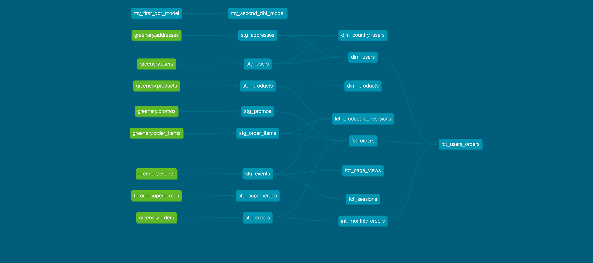

# (Part 1) Create new models
---

Conversion rate == # of unique sessions with a purchase event / total number of unique sessions

## 1 - What is our overall conversion rate?
Answer: 62.5%

Query:
```sql
with temp as (
  select 
    count(distinct session_id) as tot_sessions
    , sum(checkout) as purchase_sessions 
  from dbt_andrea_b.fct_sessions
)
select 
  purchase_sessions / tot_sessions * 100 as conversion_rate
from temp
```
## 2 - What is our conversion rate by product?
Query:
```sql
select 
  product_name,
  tot_sessions,
  tot_purchases_sessions,
  round(tot_purchases_sessions*1.0/tot_sessions*100.0,2) as conversion_rate
from dbt_andrea_b.fct_product_conversions
order by 4 desc
```

Answer: 
Products conversion rate is affected by:
- quality of the traffic reaching product page (i.e. how much are interested the users reaching product page) 
- entry point of the users (adv, organic, search...)
- device (mobile vs desktop)
- quality of detail page (description, images...)
- discount applied
- pricing

|    product_name     | number_of_sessions | number_of_purchasess | conversion_rate |
|---------------------|-------------------|-----------------------|-----------------|
| Monstera            |                27 |                    18 |      **66.67%** |
| String of pearls    |                64 |                    39 |      **60.94** |
| Arrow Head          |                63 |                    35 |      **55.56** |
| Cactus              |                55 |                    30 |      **54.55** |
| ZZ Plant            |                63 |                    34 |      **53.97** |
| Bamboo              |                67 |                    36 |      **53.73** |
| Rubber Plant        |                54 |                    28 |      **51.85** |
| Monstera            |                49 |                    25 |      **51.02** |
| Calathea Makoyana   |                53 |                    27 |      **50.94** |
| Fiddle Leaf Fig     |                56 |                    28 |      **50.00** |
| Majesty Palm        |                67 |                    33 |      **49.25** |
| Aloe Vera           |                65 |                    32 |      **49.23** |
| Devil's Ivy         |                45 |                    22 |      **48.89** |
| Philodendron        |                62 |                    30 |      **48.39** |
| Jade Plant          |                46 |                    22 |      **47.83** |
| Spider Plant        |                59 |                    28 |      **47.46** |
| Pilea Peperomioides |                59 |                    28 |      **47.46** |
| Dragon Tree         |                62 |                    29 |      **46.77** |
| Money Tree          |                56 |                    26 |      **46.43** |
| Orchid              |                75 |                    34 |      **45.33** |
| Bird of Paradise    |                60 |                    27 |      **45.00** |
| Ficus               |                68 |                    29 |      **42.65** |
| Birds Nest Fern     |                78 |                    33 |      **42.31** |
| Pink Anthurium      |                74 |                    31 |      **41.89** |
| Boston Fern         |                63 |                    26 |      **41.27** |
| Alocasia Polly      |                51 |                    21 |      **41.18** |
| Peace Lily          |                66 |                    27 |      **40.91** |
| Ponytail Palm       |                70 |                    28 |      **40.00** |
| Snake Plant         |                73 |                    29 |      **39.73** |
| Angel Wings Begonia |                61 |                    24 |      **39.34** |
| Pothos              |                61 |                    21 |      **34.43** |

---
# (Part 2) Create a Macro 
---
I created the macro `agg_by_col`, that aggregates the for each distinct value in a column. The macro is used in `fct_sessions` model to aggregate by session_events.

---
# (Part 3) Granting permissions
---
Added in `dbt_project.yml` file. I am still unclear why we need to put this since I never had to deal with granting permissions.

---
# (Part 4) dbt Packages
---
I installed `dbt_utils`, `codegen` and `dbt_expectations`.
I used
- `group_by`in various models
- `expression_is_true` as test for `fct_orders` table (see `schema_core.yml`), in order to check if `order_total_usd = order_cost_usd + shipping_cost_usd - promo_discount_usd`

---
# (Part 5) DAG


---


